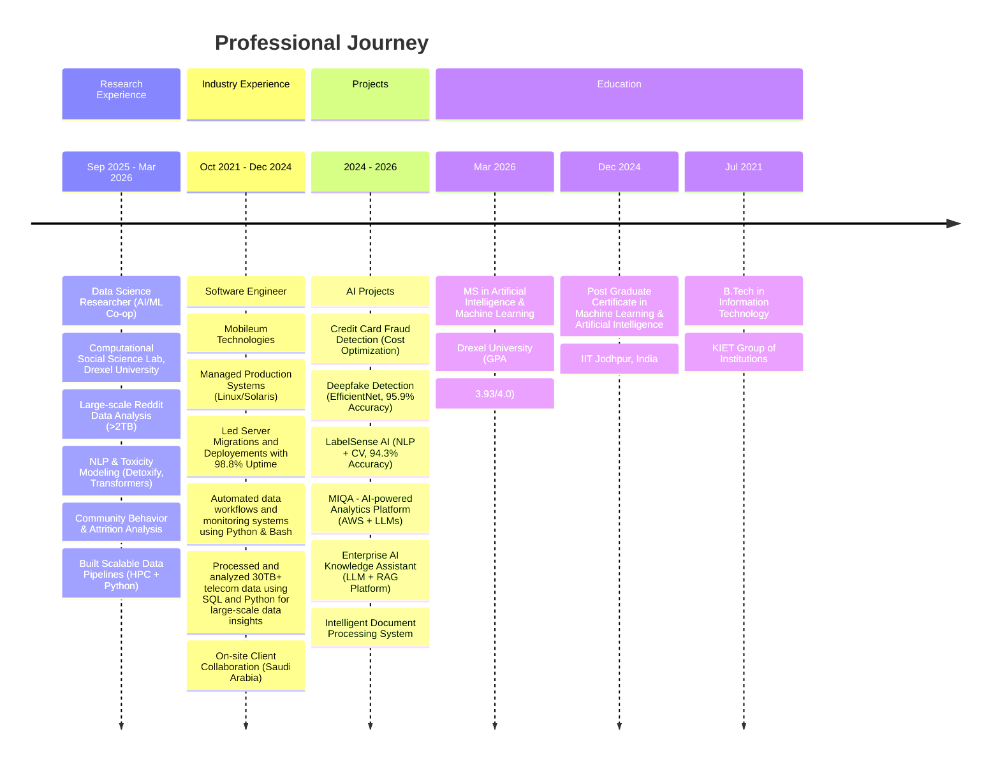

# 🧬 Shobhit Dixit

### AI/ML Engineer | Data Scientist | Production ML Systems | Generative AI Architect

[%20452--9020-25D366?style=flat-square&logo=whatsapp&logoColor=white)](tel:+12154529020)

---

## 📊 Research Summary

AI/ML Engineer and Data Scientist with **nearly 4 years** of production experience architecting and deploying **scalable machine learning** and **generative AI solutions** across different domains. Specialized in building **enterprise-grade ML pipelines**, **real-time inference systems**, and **LLM-powered applications** using PyTorch, TensorFlow, and AWS infrastructure.

**Current Focus:** Retrieval-Augmented Generation (RAG) architectures, semantic search systems, explainable AI frameworks, and containerized ML deployment strategies for enterprise applications.

---

## 🔧 What Drives Me

- 🚀 Building systems that are **useful, reliable, and smart**  
- 🧼 Writing **clean, scalable code** across different tech stacks  
- 📊 Working on projects that involve **learning, data, and improvement**  
- 🤔 Always asking: _"What can I do better, and how can I learn from this?"_

## 💼 Career Timeline

## 📬 Get in Touch

---

<!-- Elite Tech Stack -->

## 🛠️ **COMPREHENSIVE TECHNOLOGY ARSENAL**

<table width="100%">
<tr>
<td width="33%" valign="top">

### **💻 PROGRAMMING LANGUAGES**

<picture>
<source media="(prefers-color-scheme: dark)" srcset="https://skillicons.dev/icons?i=python,c,cpp,java&theme=dark">
<source media="(prefers-color-scheme: light)" srcset="https://skillicons.dev/icons?i=python,c,cpp,java&theme=light">

</picture> 

**CORE COMPETENCIES**

- 🎯 **Data Structures & Algorithms**
- 🧮 **Object-Oriented Programming**
- 💡 **Problem Solving & Logic**
- 🏆 **Competitive Programming**

</td>
<td width="33%" valign="top">

### **🌐 WEB TECHNOLOGIES**

<picture>
<source media="(prefers-color-scheme: dark)" srcset="https://skillicons.dev/icons?i=html,css,js,react&theme=dark">
<source media="(prefers-color-scheme: light)" srcset="https://skillicons.dev/icons?i=html,css,js,react&theme=light">

</picture> 

**DEVELOPMENT SKILLS**

- 🎨 **Responsive Web Design**
- ⚛️ **Modern Frontend Frameworks**
- 🔄 **RESTful API Integration**
- 📱 **Cross-Platform Development**

</td>
<td width="33%" valign="top">

### **🤖 AI/ML & EMERGING TECH**

<picture>
<source media="(prefers-color-scheme: dark)" srcset="https://skillicons.dev/icons?i=tensorflow,pytorch,flask,git&theme=dark">
<source media="(prefers-color-scheme: light)" srcset="https://skillicons.dev/icons?i=tensorflow,pytorch,flask,git&theme=light">

</picture> 

**AI/ML EXPERTISE**

- 🧠 **Machine Learning Models**
- 💬 **Natural Language Processing**
- 🤖 **Chatbot Development**
- 🔮 **Deep Learning Exploration**

</td>
</tr>
</table>

---

### **🔧 DEVELOPMENT TOOLS & PLATFORMS**

<table width="80%" align="center">
<tr>
<td width="25%" align="center">

**VERSION CONTROL**

<picture>
<source media="(prefers-color-scheme: dark)" srcset="https://skillicons.dev/icons?i=git,github&theme=dark">
<source media="(prefers-color-scheme: light)" srcset="https://skillicons.dev/icons?i=git,github&theme=light">

</picture>

</td>
<td width="25%" align="center">

**IDEs & EDITORS**

<picture>
<source media="(prefers-color-scheme: dark)" srcset="https://skillicons.dev/icons?i=vscode,pycharm&theme=dark">
<source media="(prefers-color-scheme: light)" srcset="https://skillicons.dev/icons?i=vscode,pycharm&theme=light">

</picture>

</td>
<td width="25%" align="center">

**DATABASES**

<picture>
<source media="(prefers-color-scheme: dark)" srcset="https://skillicons.dev/icons?i=mysql,mongodb&theme=dark">
<source media="(prefers-color-scheme: light)" srcset="https://skillicons.dev/icons?i=mysql,mongodb&theme=light">

</picture>

</td>
<td width="25%" align="center">

**PLATFORMS**

<picture>
<source media="(prefers-color-scheme: dark)" srcset="https://skillicons.dev/icons?i=linux,windows&theme=dark">
<source media="(prefers-color-scheme: light)" srcset="https://skillicons.dev/icons?i=linux,windows&theme=light">

</picture>

</td>
</tr>
</table>

---

<!-- Skills Matrix -->

## 📊 **COMPETENCY MATRIX**

<table width="100%">
<tr>
<td width="25%" align="center" valign="top">

### **💻 SOFTWARE ENGINEERING**

**CAPABILITIES**
- Frontend Development
- Backend Integration
- Database Design
- API Development
- Code Optimization

</td>
<td width="25%" align="center" valign="top">

### **🤖 AI & MACHINE LEARNING**

**CAPABILITIES**
- NLP Applications
- Chatbot Development
- ML Model Training
- Data Processing
- Algorithm Design

</td>
<td width="25%" align="center" valign="top">

### **📊 DATA SCIENCE**

**CAPABILITIES**
- Data Cleaning
- Data Preprocessing
- Data Visualization (Matplotlib, Power BI)
- Statistical Analysis
- Predictive Modeling
- Exploratory Data Analysis (EDA)

</td>
<td width="25%" align="center" valign="top">

### **📡 SYSTEMS & DATA ENGINEERING**

**CAPABILITIES**
- ETL Pipelines
- Data Pipelines (AWS, SQL)
- API Data Integration
- Performance Optimization
- Distributed Systems Basics

</td>
<td width="25%" align="center" valign="top">

</td>
</tr>
</table>

---

## 🚀 Tech Toolkit

### 🧑‍💻 Core Skills & Tools

### 🧠 ML / DL & Data Science

### ☁️ Cloud, DevOps & Platforms

### 🛠️ Backend & Analytics

---

## 📜 Professional Certificates

- 🎓 Google Data Analytics  
- 🎓 IBM Data Science
- 🎓 IBM Computer Vision & Image Processing
---

## 🙌 Thank You for stopping by! 🚀

Let’s connect and **build intelligent, meaningful, and scalable solutions** together.

> _"Strive not to be a success, but rather to be of value."_ : *Albert Einstein*

  
🌟 _Open to collaborations, conversations, and opportunities._  
📈 _Always learning. Always building._  

